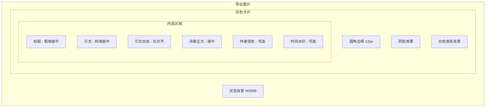

# 诗歌下载功能 Canvas 2D API 实现 TODO

> **🤖 AI 助手注意 (AI Assistant Attention)**
> 在执行本文件中的任何任务前，你必须首先阅读并严格遵守位于 `documentation/ai-collaboration-guide.md` 的全局协作指南。

## 目标

使用 Canvas 2D API 原生绘制诗歌卡片图片，替代不可行的 html2canvas 方案。

**业务价值**：
- 📸 生成精美的诗歌分享图片
- 🎨 完全控制视觉效果，实现"所见即所得"
- 📱 跨平台一致性，避免 html2canvas 的 CSS 兼容性问题

**技术决策背景**：
- html2canvas 不支持 `backdrop-filter`（毛玻璃效果）
- html2canvas 在复杂 CSS 下会出现空白/内容丢失问题
- Canvas 2D API 提供完全可控的渲染管线

## 需求规格

### 视觉效果要求

#### 图片结构


#### 层次结构示意
```
┌─────────────────────────────────────┐
│         灰色背景 (#f1f5f9)           │
│   ┌─────────────────────────────┐   │
│   │     白色卡片 (圆角+阴影)      │   │
│   │                             │   │
│   │      观我生 · 论无咎          │   │
│   │       (标题)                 │   │
│   │                             │   │
│   │   艮其背，不获其身...         │   │
│   │       (引文)                 │   │
│   │                             │   │
│   │      ——《易经·艮》           │   │
│   │       (出处)                 │   │
│   │                             │   │
│   │   请你相信我们的隐喻...       │   │
│   │       (正文)                 │   │
│   │                             │   │
│   │  ─────────────────────────  │   │
│   │   作者: 陆家明 × lujiaming    │   │
│   │                             │   │
│   │  2025-11-25 12:09于©陆家花园  │   │
│   │       (水印)                 │   │
│   │                             │   │
│   └─────────────────────────────┘   │
└─────────────────────────────────────┘
```

### 详细样式规格

#### 背景层
| 属性 | 值 | 说明 |
|------|-----|------|
| 背景色 | `#f1f5f9` | 页面灰色背景，提供对比 |
| 内边距 | 24px | 卡片与图片边缘的间距 |

#### 卡片层
| 属性 | 值 | 说明 |
|------|-----|------|
| 背景 | `linear-gradient(135deg, #ffffff 0%, #f8fafc 100%)` | 白色到浅灰渐变 |
| 圆角 | `12px` | 统一圆角 |
| 阴影 | `0 8px 32px rgba(0,0,0,0.1)` | 立体感阴影 |
| 内边距 | `64px 32px 40px 32px` | 上64px，左右32px，下40px |

#### 字体规格
| 元素 | 字体 | 字号 | 字重 | 颜色 |
|------|------|------|------|------|
| 标题 | Noto Serif SC / 宋体 | 48px | bold | `#1f2937` |
| 引文 | Noto Serif SC / 宋体 | 28px | italic | `#4b5563` |
| 正文 | Noto Serif SC / 宋体 | 32px | 600 | `#1f2937` |
| 作者 | Noto Serif SC / 宋体 | 24px | 600 | `#374151` |
| 水印 | Noto Serif SC / 宋体 | 20px | normal | `#9ca3af` |

#### 作者与水印
| 场景 | 作者格式 | 水印 |
|------|---------|------|
| ResultScreen | 无 | 无 |
| GongBiView | 无 | 无 |
| MyWorksView | `陆家明 × {用户名}` | `{时间}于©陆家花园` |

## 任务列表

---

### **阶段11-25_A：Canvas 绘图服务核心开发**

#### - [x] 任务A.1：创建 PoemImageGenerator 服务
- **核心思想**: 封装 Canvas 绘图逻辑，提供简洁的 API
- 实际改动文件：
  - `lugarden_universal/frontend_vue/src/modules/zhou/services/PoemImageGenerator.ts`（新建）
- 完成状态：✅ 已完成

#### - [x] 任务A.2：实现绘制管线
- **核心思想**: 按需求规格绘制完整的诗歌卡片
- 完成状态：✅ 已完成
- 执行步骤：
  - [x] 绘制灰色背景层（#f1f5f9）
  - [x] 绘制白色卡片（渐变背景、圆角、阴影）
  - [x] 绘制标题、引文、出处、正文
  - [x] 绘制作者信息（带分隔线，整个内容区域宽度）

---

### **阶段11-25_B：业务组件集成**

#### - [x] 任务B.1：PoemViewer 组件接入
- **核心思想**: 用 PoemImageGenerator 替换原有下载逻辑
- 实际改动文件：
  - `lugarden_universal/frontend_vue/src/modules/zhou/components/PoemViewer.vue`
- 完成状态：✅ 已完成

#### - [x] 任务B.2：MyWorksView 启用下载功能
- **核心思想**: 为我的作品页面启用图片下载
- 实际改动文件：
  - `lugarden_universal/frontend_vue/src/core/auth/views/MyWorksView.vue`
- 完成状态：✅ 已完成

#### - [x] 任务B.3：添加时间水印功能
- **核心思想**: 在MyWorksView下载的图片中显示创建时间水印
- 水印格式：`2025-11-25 12:09于©陆家花园`
- 实际改动文件：
  - `lugarden_universal/frontend_vue/src/modules/zhou/services/PoemImageGenerator.ts`
  - `lugarden_universal/frontend_vue/src/modules/zhou/types/zhou.ts`
  - `lugarden_universal/frontend_vue/src/modules/zhou/components/PoemViewer.vue`
  - `lugarden_universal/frontend_vue/src/core/auth/views/MyWorksView.vue`
- 完成状态：✅ 已完成

---

## 当前状态
✅ 已完成

---
*基于 html2canvas 排障结论创建，采用 Canvas 2D API 方案*
